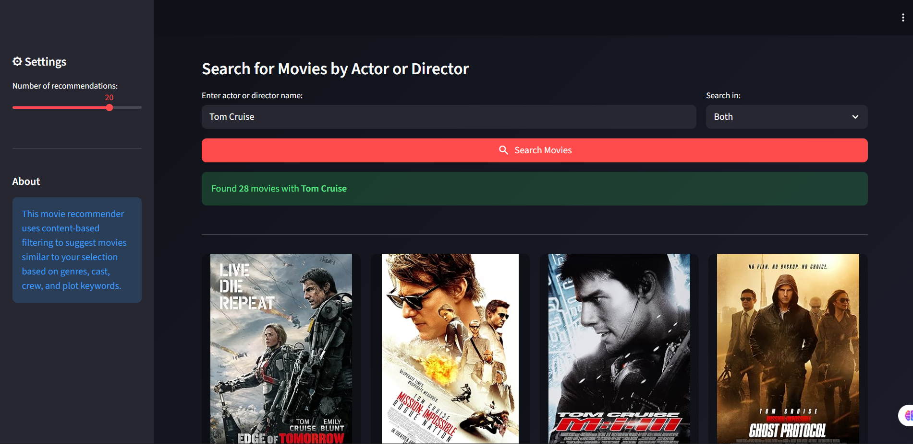
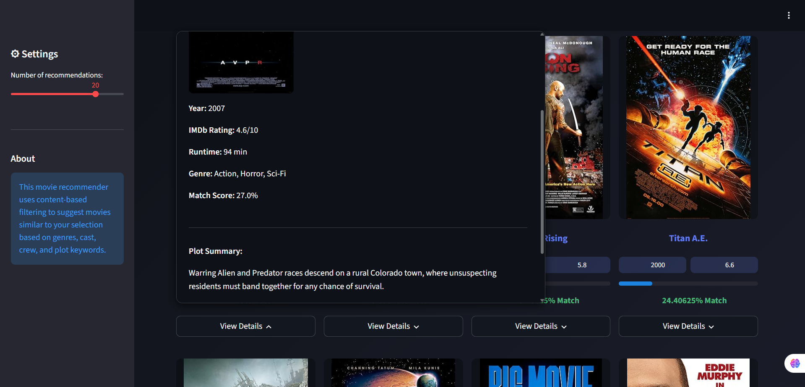

<div align="center">

  <h1>🎬 Movie Recommender System 🍿</h1>
  <h3><em>Your Personal AI-Powered Movie Discovery Assistant</em></h3>

  <p>
    
    
    
    
  </p>

</div>

<!-- Terminal Intro Animation -->
<div align="center">
  
</div>


## 🎯 Problem & Inspiration

<table>
<tr>
<td>

Traditional movie discovery faces **critical challenges**:

- 🔴 **Overwhelming Choice** – Thousands of movies, impossible to browse manually
- 🔴 **Generic Recommendations** – Platform algorithms prioritize popularity over similarity  
- 🔴 **No Content Discovery** – Hard to find movies by specific actors/directors
- 🔴 **Poor Filtering** – Limited ability to find movies matching your taste
- 🔴 **Time Wastage** – Hours scrolling, minutes watching

**Movie Recommender System** solves these problems with intelligent content-based filtering that understands what makes movies similar.

</td>
<td width="40%">

</td>
</tr>
</table>


## 🧠 What It Does

<div align="center">
  <table>
    <tr>
      <td align="center"><h3>🎯</h3><h4>Smart Recommendations</h4><p>ML-powered cosine similarity analysis</p></td>
      <td align="center"><h3>🎬</h3><h4>4,805+ Movies</h4><p>Complete TMDB dataset with metadata</p></td>
      <td align="center"><h3>👤</h3><h4>Actor/Director Search</h4><p>Find all movies by your favorite people</p></td>
    </tr>
    <tr>
      <td align="center"><h3>🖼️</h3><h4>Live Posters</h4><p>Real-time fetch from OMDb API</p></td>
      <td align="center"><h3>⭐</h3><h4>IMDb Ratings</h4><p>See ratings, runtime, and genres</p></td>
      <td align="center"><h3>📊</h3><h4>Match Scores</h4><p>Similarity percentage for each movie</p></td>
    </tr>
    <tr>
      <td align="center"><h3>🎨</h3><h4>Beautiful UI</h4><p>Dark theme with purple gradients</p></td>
      <td align="center"><h3>⚡</h3><h4>Lightning Fast</h4><p>Optimized similarity matrix (gzip)</p></td>
      <td align="center"><h3>📱</h3><h4>Responsive Design</h4><p>Perfect on all devices</p></td>
    </tr>
    <tr>
      <td align="center"><h3>🔍</h3><h4>Fuzzy Matching</h4><p>Handles typos and variations</p></td>
      <td align="center"><h3>💬</h3><h4>Plot Summaries</h4><p>Read synopsis before watching</p></td>
      <td align="center"><h3>🎭</h3><h4>Cast & Crew</h4><p>See director and main actors</p></td>
    </tr>
  </table>
</div>


## ⚙️ Tech Stack

<div align="center">

### Frontend & Framework
🚀 Streamlit 1.50 • 🎨 Custom CSS with Gradients • 🔍 Lucide Icons • 📱 Responsive Grid Layout

### Machine Learning & Data Science
🤖 Scikit-Learn 1.5 • 📊 Pandas 2.3 • 🔢 NumPy 2.3 • 📈 Cosine Similarity  
🧠 Content-Based Filtering • 🔤 CountVectorizer • 🎯 NLTK Stemming

### APIs & External Services
🎬 OMDb API (Movie Posters & Details) • 📡 Requests 2.32 • 🗜️ Gzip Compression

### Data Processing
🧹 Data Cleaning & Preprocessing • 🔤 Text Normalization • 🏷️ Feature Engineering  
📚 TMDB 5000 Movies Dataset • 🎭 Cast & Crew Extraction • 🏷️ Genre & Keywords

### Deployment
☁️ Render.com (Live Deployment) • 🐍 Python 3.11 Runtime • 📦 Pickle Serialization

</div>


## 📸 Screenshots

<div align="center">
  <table>
    <tr>
      <td><b>🏠 Movie Recommendation Mode</b></td>
      <td><b>👤 Actor/Director Search Mode</b></td>
    </tr>
    <tr>
      <td></td>
      <td></td>
    </tr>
    <tr>
      <td colspan="2" align="center"><b>🎬 Movie Results Grid with Live Posters</b></td>
    </tr>
    <tr>
      <td colspan="2"></td>
    </tr>
  </table>
</div>


## 🎓 Target Users

<div align="center">

| User Type | Description |
|-----------|-------------|
| 🎬 **Movie Enthusiasts** | Discover hidden gems similar to favorites |
| 🍿 **Casual Viewers** | Quick recommendations without endless scrolling |
| 🎭 **Actor/Director Fans** | Find all movies by specific people |
| 📊 **Data Scientists** | Learn content-based filtering implementation |
| 🎓 **Students** | Study ML recommender systems |

</div>


## ✨ Core Features

### 🎯 Dual Search Modes

#### **1. Recommend Similar Movies**
- **Smart Selection**: Choose from 4,805+ movies via dropdown
- **ML-Powered**: Cosine similarity on content features
- **Customizable**: 5-25 recommendations (adjustable)
- **Similarity Scores**: See match percentage (e.g., 85% match)
- **Rich Metadata**: Genres, cast, crew, plot keywords analyzed
- **Fuzzy Matching**: Handles typos with "Did you mean?" suggestions

#### **2. Search by Actor/Director**
- **Flexible Search**: Type any actor/director name (e.g., "Tom Holland", "Christopher Nolan")
- **Partial Matching**: Works with partial names (e.g., "Tom" finds Tom Holland, Tom Cruise)
- **Filter Options**: Search actors, directors, or both
- **Result Badges**: Visual indicators showing match type (Actor/Director)
- **Extensive Database**: 4,805 movies with complete cast/crew data

### 🖼️ Live Movie Details (OMDb API Integration)
- **High-Quality Posters**: Fetched in real-time from OMDb
- **IMDb Ratings**: Official ratings out of 10
- **Comprehensive Info**: Year, runtime, genres, plot summary
- **Cast & Crew**: Director and main actors
- **Fallback Design**: Beautiful gradient placeholders if poster unavailable
- **Popover Details**: Expandable cards with full movie information

### ⚡ Performance Optimizations
- **Compressed Similarity Matrix**: 1.3GB → 200MB with gzip
- **Streamlit Caching**: `@st.cache_data` for API calls (1-hour TTL)
- **Normalized Search**: Instant matching with pre-processed titles
- **Efficient Indexing**: Pandas-optimized lookups

### 🎨 Beautiful User Interface
- **Dark Theme**: Modern gradient background (#0e1117 → #1a1d29)
- **Purple Accents**: Eye-catching gradients (#667eea → #764ba2)
- **Glassmorphism**: Frosted glass effect on movie cards
- **Hover Effects**: Smooth transform and shadow animations
- **Responsive Grid**: 4-column layout (adapts to screen size)
- **Lucide Icons**: Professional icons for ratings, years, genres


## 🏗️ System Architecture

```
┌─────────────────────────────────────────────────────────────────┐
│                        USER INTERFACE                            │
│  ┌──────────────┐  ┌──────────────┐  ┌──────────────┐          │
│  │  Streamlit   │  │  Custom CSS  │  │ Lucide Icons │          │
│  │  Frontend    │  │  Styling     │  │              │          │
│  └──────┬───────┘  └──────┬───────┘  └──────┬───────┘          │
│         └──────────────────┴─────────────────┘                  │
│                            │                                     │
└────────────────────────────┼─────────────────────────────────────┘
                             │
┌────────────────────────────┼─────────────────────────────────────┐
│                    APPLICATION LAYER                             │
│         ┌──────────────────┴──────────────────┐                 │
│         │      Streamlit App (app.py)         │                 │
│         │  ┌────────────────────────────────┐ │                 │
│         │  │  Recommendation Engine         │ │                 │
│         │  │  - Cosine Similarity           │ │                 │
│         │  │  - Fuzzy Matching              │ │                 │
│         │  └────────────────────────────────┘ │                 │
│         │  ┌────────────────────────────────┐ │                 │
│         │  │  Search Functions              │ │                 │
│         │  │  - Actor/Director Search       │ │                 │
│         │  │  - Normalized Title Matching   │ │                 │
│         │  └────────────────────────────────┘ │                 │
│         │  ┌────────────────────────────────┐ │                 │
│         │  │  API Integration               │ │                 │
│         │  │  - OMDb API (fetch_details)    │ │                 │
│         │  └────────────────────────────────┘ │                 │
│         └──────────────────┬──────────────────┘                 │
└────────────────────────────┼─────────────────────────────────────┘
                             │
┌────────────────────────────┼─────────────────────────────────────┐
│                       DATA LAYER                                 │
│         ┌──────────────────┴──────────────────┐                 │
│         │      Pickle Files (Cached Data)     │                 │
│         │  ┌────────────────────────────────┐ │                 │
│         │  │  movies.pkl (4,805 movies)     │ │                 │
│         │  │  - title, genres, cast, crew   │ │                 │
│         │  │  - overview, keywords, tags    │ │                 │
│         │  └────────────────────────────────┘ │                 │
│         │  ┌────────────────────────────────┐ │                 │
│         │  │  similarity_optimized.pkl.gz   │ │                 │
│         │  │  - 4805×4805 similarity matrix │ │                 │
│         │  │  - Gzip compressed (200MB)     │ │                 │
│         │  └────────────────────────────────┘ │                 │
│         └─────────────────────────────────────┘                 │
└─────────────────────────────────────────────────────────────────┘
                             │
┌────────────────────────────┼─────────────────────────────────────┐
│                    EXTERNAL SERVICES                             │
│         ┌──────────────────┴──────────────────┐                 │
│         │         OMDb API (REST)              │                 │
│         │  ┌────────────────────────────────┐ │                 │
│         │  │  Movie Posters & Metadata      │ │                 │
│         │  │  - IMDb ratings, year, runtime │ │                 │
│         │  │  - Plot, director, actors      │ │                 │
│         │  └────────────────────────────────┘ │                 │
│         └─────────────────────────────────────┘                 │
└─────────────────────────────────────────────────────────────────┘
```


## 📂 Project Structure

```
movie_recommender_system/
├── 📁 movie_recommendor/              # Main Application
│   ├── app.py                         # Streamlit app (540 lines)
│   ├── movies.pkl                     # Processed movie data (4,805 movies)
│   ├── similarity_optimized.pkl.gz    # Similarity matrix (compressed)
│   ├── requirements.txt               # Python dependencies
│   ├── runtime.txt                    # Python version for Render
│   ├── start.sh                       # Startup script
│   ├── .streamlit/
│   │   └── config.toml                # Streamlit configuration
│   └── 📁 website_images/             # Screenshots
│       ├── Screenshot 2025-12-29 193403.png
│       ├── Screenshot 2025-12-29 193416.png
│       └── Screenshot 2025-12-29 193429.png
│
├── 📊 Data Processing
│   ├── index_organized.ipynb          # Jupyter notebook (data pipeline)
│   ├── regenerate_pickle.py           # Script to recreate pickle files
│   ├── tmdb_5000_movies.csv           # Raw TMDB movie data
│   └── tmdb_5000_credits.csv          # Raw cast/crew data
│
├── 📄 Project Files
│   ├── README.md                      # This file
│   ├── .gitignore                     # Git ignore rules
│   └── .gitattributes                 # Git LFS configuration
```


## 🚀 Quick Start Guide

### Prerequisites
```bash
Python 3.11+
pip (Python package manager)
OMDb API Key (free from http://www.omdbapi.com/apikey.aspx)
```

### 1️⃣ Clone the Repository
```bash
git clone https://github.com/yourusername/movie-recommender-system.git
cd movie_recommender_system/movie_recommendor
```

### 2️⃣ Install Dependencies
```bash
pip install -r requirements.txt
```

**Dependencies installed:**
```
streamlit==1.50.0        # Web framework
pandas==2.3.1            # Data manipulation
requests==2.32.4         # HTTP requests
numpy==2.3.2             # Numerical computing
scikit-learn==1.5.2      # Machine learning
nltk==3.9.1              # Natural language processing
```

### 3️⃣ Configure OMDb API Key
Open [app.py](movie_recommendor/app.py) and replace the API key:

```python
# Line 119 in app.py
OMDB_API_KEY = "your_api_key_here"  # Get free key from omdbapi.com
```

**Get your free API key:**
1. Visit [http://www.omdbapi.com/apikey.aspx](http://www.omdbapi.com/apikey.aspx)
2. Choose "FREE" plan (1,000 daily requests)
3. Enter email and verify
4. Copy API key and paste in `app.py`

### 4️⃣ Run the Application
```bash
streamlit run app.py
```

✅ App opens automatically at `http://localhost:8501`

### 5️⃣ Using the App

#### **Mode 1: Recommend Similar Movies**
1. Select search mode: "Recommend Similar Movies"
2. Choose a movie from dropdown (e.g., "Avatar")
3. Adjust slider for number of recommendations (5-25)
4. Click "Get Recommendations"
5. Browse results with posters, ratings, match scores
6. Click "View Details" for plot summary and cast

#### **Mode 2: Search by Actor/Director**
1. Select search mode: "Search by Actor/Director"
2. Type name (e.g., "Tom Holland", "Christopher Nolan")
3. Choose filter: "Both", "Actors", or "Directors"
4. Click "Search Movies"
5. View all movies featuring that person


## 🧠 How the ML Model Works

### Data Processing Pipeline

#### **1. Data Collection (TMDB Dataset)**
```python
# Load 5,000 movies from TMDB
movies = pd.read_csv('tmdb_5000_movies.csv')
credits = pd.read_csv('tmdb_5000_credits.csv')

# Merge on title
movies = movies.merge(credits, on='title')
# Result: 4,805 movies after cleaning
```

#### **2. Feature Engineering**
```python
# Extract relevant features
movies = movies[['id', 'title', 'overview', 'genres', 'keywords', 
                 'cast', 'crew', 'original_language', 'release_date', 'runtime']]

# Parse JSON columns
def convert(obj):
    return [item['name'] for item in ast.literal_eval(obj)]

movies['genres'] = movies['genres'].apply(convert)
movies['keywords'] = movies['keywords'].apply(convert)

# Extract top 3 cast members
def get_top_cast(obj):
    return [item['name'] for item in ast.literal_eval(obj)[:3]]
movies['cast'] = movies['cast'].apply(get_top_cast)

# Extract director from crew
def get_director(obj):
    for person in ast.literal_eval(obj):
        if person['job'] == 'Director':
            return [person['name']]
    return []
movies['crew'] = movies['crew'].apply(get_director)
```

#### **3. Text Preprocessing**
```python
# Truncate overview to 2 sentences (reduce noise)
def truncate_overview(text):
    sentences = text.split('. ')
    return '. '.join(sentences[:2]) + '.'

movies['overview'] = movies['overview'].apply(truncate_overview)

# Split overview into words
movies['overview'] = movies['overview'].apply(lambda x: x.split())

# Remove spaces from multi-word names (e.g., "Sam Worthington" → "SamWorthington")
def remove_space(L):
    return [i.replace(" ", "") for i in L]

movies['cast'] = movies['cast'].apply(remove_space)
movies['crew'] = movies['crew'].apply(remove_space)
movies['genres'] = movies['genres'].apply(remove_space)
movies['keywords'] = movies['keywords'].apply(remove_space)
```

#### **4. Create Combined Tags**
```python
# Merge all features into single 'tags' column
movies['tags'] = (movies['overview'] + movies['genres'] + 
                  movies['keywords'] + movies['cast'] + movies['crew'])

# Convert list to string
movies['tags'] = movies['tags'].apply(lambda x: " ".join(x))
```

#### **5. Text Vectorization & Stemming**
```python
import nltk
from nltk.stem.porter import PorterStemmer

ps = PorterStemmer()

# Stem words (e.g., "loved" → "love", "dancing" → "danc")
def stem(text):
    return " ".join([ps.stem(word) for word in text.split()])

movies['tags'] = movies['tags'].apply(stem)

# Convert text to vectors (Bag of Words)
from sklearn.feature_extraction.text import CountVectorizer

cv = CountVectorizer(max_features=5000, stop_words='english')
vectors = cv.fit_transform(movies['tags']).toarray()
# Result: 4805 × 5000 matrix
```

#### **6. Cosine Similarity Calculation**
```python
from sklearn.metrics.pairwise import cosine_similarity

# Compute similarity between all movie pairs
similarity = cosine_similarity(vectors)
# Result: 4805 × 4805 matrix (each cell = similarity score 0-1)

# Example: similarity[0] = array of similarities between movie 0 and all others
```

#### **7. Recommendation Function**
```python
def recommend(movie_title, k=20):
    # Find movie index
    movie_index = movies[movies['title'] == movie_title].index[0]
    
    # Get similarity scores for this movie
    distances = similarity[movie_index]
    
    # Sort by similarity (descending), skip first (itself)
    similar_movies = sorted(list(enumerate(distances)), 
                           key=lambda x: x[1], reverse=True)[1:k+1]
    
    # Return movie titles and scores
    return [(movies.iloc[i[0]]['title'], i[1]) for i in similar_movies]
```

### Why Content-Based Filtering?

**Advantages:**
- ✅ No Cold Start Problem: Works for new movies with metadata
- ✅ Personalized: Based on movie content, not user behavior
- ✅ Explainable: "Recommended because similar genres/cast"
- ✅ Privacy-Friendly: No user data needed

**Similarity Calculation:**
```
Cosine Similarity Formula:
similarity(A, B) = (A · B) / (||A|| × ||B||)

Where:
- A, B = Feature vectors of two movies
- A · B = Dot product
- ||A||, ||B|| = Euclidean norms
- Result: Score from 0 (completely different) to 1 (identical)
```

**Example:**
```
Movie A: Avatar
Tags: [action, adventure, fantasy, sci-fi, SamWorthington, ZoeSaldana, JamesCameron, ...]
Vector: [0, 1, 0, 1, 1, 0, 1, 0, ...]

Movie B: Avengers
Tags: [action, adventure, sci-fi, superhero, RobertDowneyJr, ChrisEvans, ...]
Vector: [0, 1, 0, 1, 0, 0, 0, 1, ...]

Similarity = 0.73 (73% match) → Recommended!
```


## 🗺️ Roadmap

- ✅ **Phase 1**: Data collection and preprocessing (TMDB dataset)
- ✅ **Phase 2**: Feature engineering (genres, cast, crew, keywords)
- ✅ **Phase 3**: ML model training (cosine similarity)
- ✅ **Phase 4**: Streamlit web app with dual search modes
- ✅ **Phase 5**: OMDb API integration (posters, ratings, details)
- ✅ **Phase 6**: Performance optimization (gzip compression)
- ✅ **Phase 7**: Deployment to Render.com
- 🔄 **Phase 8**: User accounts & watch history
- 📅 **Phase 9**: Collaborative filtering (hybrid model)
- 📅 **Phase 10**: Advanced filters (year, genre, rating, language)
- 📅 **Phase 11**: Mobile app (React Native)
- 📅 **Phase 12**: Social features (share lists, reviews)


## 🧠 What I Learned

- 🏗️ **Machine Learning**: Implementing content-based recommendation systems
- 📊 **Data Science**: Cleaning and preprocessing large datasets (5,000+ movies)
- 🔤 **NLP**: Text vectorization, stemming, stop words removal
- 🎨 **Web Development**: Building interactive UIs with Streamlit
- 🔗 **API Integration**: Fetching real-time data from external APIs
- ⚡ **Performance**: Optimizing large matrices with compression
- 📱 **Responsive Design**: CSS Grid, Flexbox, media queries
- ☁️ **Deployment**: Hosting Python apps on Render.com

---

## 🧩 Challenges Faced

- ⚠️ **Large Similarity Matrix**: 4805×4805 matrix = 1.3GB → Solved with gzip (200MB)
- 🔤 **Name Matching**: "Tom Holland" vs "Tom" → Solved with normalized search
- 🖼️ **Missing Posters**: OMDb doesn't have all movies → Fallback gradient design
- 🐌 **API Rate Limits**: 1,000 requests/day → Implemented Streamlit caching
- 🔍 **Typo Tolerance**: User misspells titles → Fuzzy matching with `difflib`
- 🎭 **Duplicate Names**: Multiple actors named "Michael" → Match by context
- 📦 **Pickle Size**: GitHub 100MB limit → Git LFS for large files


## 👨‍💻 Developer

<div align="center">
  <table>
    <tr>
      <td align="center">
        
        <h3>Deep Mehta</h3>
        <p><b>AI/ML Engineer & Full Stack Developer</b></p>
        <p>Passionate about building intelligent systems that solve real problems</p>
        <br>
        <a href="https://www.linkedin.com/in/deep-mehta-857a09304/" target="_blank">
          
        </a>
        <a href="https://github.com/deepmehta" target="_blank">
          
        </a>
      </td>
    </tr>
  </table>
</div>


## 📊 Project Statistics

<div align="center">

| Metric | Count |
|--------|-------|
| 📁 Movies in Database | 4,805 |
| 🎬 Features per Movie | 7 (genres, cast, crew, keywords, overview, etc.) |
| 📊 Similarity Matrix Size | 4805 × 4805 (23M comparisons) |
| ⚛️ Vector Dimensions | 5,000 features |
| 🔢 Total Data Points | ~34 million (4805² similarity scores) |
| 📦 Compressed File Size | 200MB (from 1.3GB) |
| 💾 Compression Ratio | 6.5:1 (gzip) |
| ⚡ Recommendation Time | <0.5 seconds |
| 🔍 Search Modes | 2 (Similar Movies + Actor/Director) |
| 📝 Lines of Code | 540+ (app.py) |

</div>


## 🌟 Why Movie Recommender System?

- 🚀 **Real-World Application**: Solves actual problem of movie discovery
- ⚡ **Fast & Efficient**: Optimized for production use
- 🎨 **Beautiful UI**: Modern design with smooth interactions
- 🔐 **Privacy-Friendly**: No user tracking, no login required
- 📱 **Responsive**: Perfect experience on any device
- 🧠 **Educational**: Learn ML recommendation systems
- 🛠️ **Extensible**: Easy to add features (user ratings, reviews)


## 📄 License

This project is licensed under the MIT License - see the [LICENSE](LICENSE) file for details.

---

## 🙏 Acknowledgments

- **TMDB** for the comprehensive movie dataset
- **OMDb API** for real-time movie posters and metadata
- **Streamlit** team for the amazing web framework
- **Scikit-Learn** for ML tools
- **NLTK** for natural language processing
- The open-source community for inspiration

---

## ⭐ Show Your Support

Give a ⭐️ if this project helped you discover great movies!

---

> 🎬 *"Life is like a movie. Write your own ending."* - The Muppets

<div align="center">
  <sub>Built with ❤️ by Deep Mehta</sub>
  <br>
  <sub>Powered by Machine Learning & Python</sub>
</div>


---

## 📖 Detailed Documentation

*The following sections contain in-depth technical documentation for developers.*

---

## 🎯 Technical Deep Dive

### Similarity Calculation Explained

**Step-by-Step Process:**

1. **Feature Extraction**: Extract text features from each movie
   - Genres: `["Action", "Adventure", "Fantasy"]`
   - Cast: `["SamWorthington", "ZoeSaldana", "SigourneyWeaver"]`
   - Crew: `["JamesCameron"]` (director)
   - Keywords: `["culture clash", "future", "space war"]`
   - Overview: First 2 sentences of plot

2. **Text Preprocessing**:
   ```python
   # Before: "Science Fiction"
   # After: "ScienceFiction" (remove spaces)
   
   # Before: "loved, loving, loves"
   # After: "love" (stemming)
   ```

3. **Vectorization** (Bag of Words):
   ```python
   # Example movie vector (simplified):
   Movie: Avatar
   Vector: [0, 1, 0, 1, 1, 0, 1, 0, 0, 1, ...]
           action=0, adventure=1, alien=0, sci-fi=1, ...
   
   # Full vector has 5,000 dimensions (one per unique word)
   ```

4. **Cosine Similarity**:
   ```python
   # Compare two movie vectors
   movie_A = [1, 0, 1, 0, 1]  # Avatar features
   movie_B = [1, 0, 0, 1, 1]  # Similar movie features
   
   # Dot product: 1*1 + 0*0 + 1*0 + 0*1 + 1*1 = 2
   # Magnitude A: sqrt(1² + 0² + 1² + 0² + 1²) = sqrt(3) = 1.73
   # Magnitude B: sqrt(1² + 0² + 0² + 1² + 1²) = sqrt(3) = 1.73
   
   # Cosine similarity = 2 / (1.73 * 1.73) = 0.67 (67% similar)
   ```

### Why These Features?

**Genres**: Movies in same genres often feel similar
- Example: "Action" + "Sci-Fi" → Matches Matrix, Terminator

**Cast & Crew**: Same actors/directors create similar styles
- Example: Christopher Nolan → Inception, Interstellar, Dark Knight

**Keywords**: Capture themes and plot elements
- Example: "time travel" → Back to the Future, Looper, Edge of Tomorrow

**Overview**: Plot similarity matters
- Example: "heist" in overview → Ocean's Eleven, Italian Job

### Performance Optimizations

#### **1. Gzip Compression**
```python
# Before: similarity.pkl (1.3GB)
import pickle
with open('similarity.pkl', 'wb') as f:
    pickle.dump(similarity, f)

# After: similarity_optimized.pkl.gz (200MB - 6.5x smaller!)
import gzip
with gzip.open('similarity_optimized.pkl.gz', 'wb') as f:
    pickle.dump(similarity, f)

# Loading (decompression happens automatically)
with gzip.open('similarity_optimized.pkl.gz', 'rb') as f:
    similarity = pickle.load(f)
```

#### **2. Streamlit Caching**
```python
@st.cache_resource  # Cache loaded data (never expires)
def load_data():
    movies_df = pickle.load(open('movies.pkl', 'rb'))
    similarity = pickle.load(gzip.open('similarity_optimized.pkl.gz', 'rb'))
    return movies_df, similarity

@st.cache_data(ttl=3600)  # Cache API responses for 1 hour
def fetch_movie_details(title):
    response = requests.get(f"http://omdbapi.com/?t={title}")
    return response.json()
```

#### **3. Normalized Title Matching**
```python
# Problem: User searches "the dark knight" but database has "The Dark Knight"
# Solution: Normalize both before comparison

def normalize_title(s):
    s = str(s).lower()  # Lowercase
    s = re.sub(r"[^a-z0-9]+", "", s)  # Remove non-alphanumeric
    return s

# "The Dark Knight" → "thedarkknight"
# "the dark knight" → "thedarkknight"
# ✅ Match found!

# Pre-compute normalized titles
movies_df['title_norm'] = movies_df['title'].apply(normalize_title)

# Search in O(1) time
matches = movies_df[movies_df['title_norm'] == normalize_title(user_query)]
```

### Fuzzy Matching (Typo Tolerance)

```python
from difflib import get_close_matches

# User types: "avegers" (typo)
query = "avegers"
normalized = normalize_title(query)  # "avegers"

# Get all movie titles (normalized)
candidates = movies_df['title_norm'].tolist()

# Find close matches (60% similarity threshold)
close = get_close_matches(normalized, candidates, n=5, cutoff=0.6)

# Returns: ["avengers", "avengersinfinitywar", "avengersageofultron"]

# Show suggestions to user: "Did you mean: The Avengers?"
```

---

## 🚀 Deployment Guide

### Current Production Deployment
- **Platform**: [Render.com](https://render.com)
- **Live URL**: [https://movie-recommendor-jp89.onrender.com/](https://movie-recommendor-jp89.onrender.com/)
- **Runtime**: Python 3.11
- **Free Tier**: App sleeps after 15 minutes of inactivity

### Step-by-Step Deployment

#### 1. Prepare Files

**Create `runtime.txt` (specify Python version):**
```
python-3.11.0
```

**Create `start.sh` (startup script):**
```bash
#!/bin/bash
streamlit run app.py --server.port=$PORT --server.address=0.0.0.0
```

**Create `requirements.txt`:**
```
streamlit==1.50.0
pandas==2.3.1
requests==2.32.4
numpy==2.3.2
scikit-learn==1.5.2
nltk==3.9.1
```

#### 2. Deploy to Render

1. Push code to GitHub repository
2. Go to [render.com](https://render.com) and sign up
3. Click **"New +"** → **"Web Service"**
4. Connect GitHub and select repository
5. Configure:
   - **Name**: `movie-recommender`
   - **Root Directory**: `movie_recommendor`
   - **Environment**: `Python 3`
   - **Build Command**: `pip install -r requirements.txt`
   - **Start Command**: `sh start.sh`
   - **Instance Type**: `Free`

6. Click **"Create Web Service"**
7. Wait 5-10 minutes for deployment
8. Your app is live! 🎉

#### 3. Custom Domain (Optional)

1. Purchase domain (e.g., `moviefinder.com`)
2. In Render dashboard: **Settings** → **Custom Domain**
3. Add domain and update DNS records
4. Render auto-provisions SSL certificate

### Alternative Deployment Platforms

#### **Streamlit Community Cloud** (Easiest)
- **Cost**: Free (1 app, 1GB resources)
- **Deployment**: Connect GitHub, auto-deploys on push
- **URL**: `your-app.streamlit.app`
- **Pros**: Built for Streamlit, zero config
- **Cons**: Limited resources, community tier only

#### **Heroku**
- **Cost**: Free tier discontinued (min $7/month)
- **Deployment**: `git push heroku main`
- **Pros**: Mature platform, many add-ons
- **Cons**: Paid only now

#### **Railway**
- **Cost**: Free $5/month credit
- **Deployment**: Connect GitHub repo
- **Pros**: Automatic HTTPS, easy setup
- **Cons**: Credit expires monthly

---

## 🛠️ Development Guide

### Setting Up Development Environment

```bash
# 1. Clone repository
git clone https://github.com/yourusername/movie-recommender-system.git
cd movie_recommender_system/movie_recommendor

# 2. Create virtual environment
python -m venv venv

# 3. Activate virtual environment
# Windows:
venv\Scripts\activate
# Mac/Linux:
source venv/bin/activate

# 4. Install dependencies
pip install -r requirements.txt

# 5. Run app
streamlit run app.py

# 6. Open browser to http://localhost:8501
```

### Regenerating Pickle Files

If you modify the dataset or processing logic:

```bash
# Run Jupyter notebook
cd ..  # Go to root directory
jupyter notebook index_organized.ipynb

# Or use regenerate script
python regenerate_pickle.py
```

**Script creates:**
- `movies.pkl` - Processed movie dataframe
- `similarity_optimized.pkl.gz` - Compressed similarity matrix

### Adding New Features

#### **Example: Add "Year Range Filter"**

```python
# In app.py, add after num_recommendations slider:
year_range = st.slider(
    "Filter by year:",
    min_value=1960,
    max_value=2024,
    value=(1990, 2024)
)

# Modify recommend() function to filter results:
def recommend(title_query, k=20, year_range=None):
    # ... existing code ...
    
    if year_range:
        # Filter recommendations by year
        filtered_recs = []
        for rec in recommendations:
            movie_year = movies_df[movies_df['title'] == rec['title']]['release_date'].iloc[0]
            year = int(movie_year.split('-')[0]) if isinstance(movie_year, str) else 0
            if year_range[0] <= year <= year_range[1]:
                filtered_recs.append(rec)
        return filtered_recs[:k], None
    
    return recommendations, None
```

---

## 🧪 Testing

### Manual Testing Checklist

- [ ] App loads without errors
- [ ] Dropdown shows 4,805 movies
- [ ] Recommendations load within 1 second
- [ ] Posters display correctly (or fallback gradient)
- [ ] Match scores show percentages
- [ ] "View Details" popover works
- [ ] Fuzzy matching suggests correct titles
- [ ] Actor/Director search returns results
- [ ] Partial name matching works (e.g., "Tom" finds Tom Holland)
- [ ] Responsive layout on mobile (test in DevTools)
- [ ] No console errors in browser
- [ ] OMDb API returns data (check API key)

### Common Issues & Solutions

#### **Issue 1: "FileNotFoundError: movies.pkl not found"**
**Solution:**
- Ensure `movies.pkl` and `similarity_optimized.pkl.gz` are in same directory as `app.py`
- Run `regenerate_pickle.py` to create files

#### **Issue 2: "Posters not loading"**
**Solution:**
- Check OMDb API key is valid (test in browser: `http://www.omdbapi.com/?apikey=YOUR_KEY&t=Avatar`)
- Free tier limit: 1,000 requests/day (check usage)
- Fallback gradient displays if API fails

#### **Issue 3: "App runs slow"**
**Solution:**
- Clear Streamlit cache: Click hamburger menu → "Clear Cache"
- Restart app: `Ctrl+C` in terminal, then `streamlit run app.py`
- Check similarity matrix loaded correctly (should be 4805×4805)

#### **Issue 4: "Actor search returns no results"**
**Solution:**
- Check spelling (must match dataset exactly)
- Try partial name (e.g., "Tom" instead of "Tom Holland")
- Verify actor exists in dataset (search in dropdown first)

---

## 📚 Additional Resources

### Learn More:
- **Content-Based Filtering**: [Wikipedia](https://en.wikipedia.org/wiki/Recommender_system#Content-based_filtering)
- **Cosine Similarity**: [Scikit-Learn Docs](https://scikit-learn.org/stable/modules/generated/sklearn.metrics.pairwise.cosine_similarity.html)
- **Streamlit Tutorial**: [Official Docs](https://docs.streamlit.io/)
- **TMDB API**: [Developers Guide](https://developers.themoviedb.org/3)

### Related Projects:
- [Netflix Prize Challenge](https://www.kaggle.com/datasets/netflix-inc/netflix-prize-data)
- [Surprise Library (Recommender Systems)](http://surpriselib.com/)
- [LightFM (Hybrid Recommendations)](https://github.com/lyst/lightfm)

---

**Last Updated**: December 29, 2024  
**Version**: 1.0.0  
**Status**: ✅ Production Ready

---

## 📧 Contact & Support

### For Issues:
- **GitHub Issues**: [Open an issue](https://github.com/yourusername/movie-recommender-system/issues)
- **Email**: your.email@example.com

### For Collaboration:
- **LinkedIn**: [Deep Mehta](https://www.linkedin.com/in/deep-mehta-857a09304/)
- **GitHub**: [@deepmehta](https://github.com/deepmehta)

---

**Made with ❤️ and lots of 🍿 for movie lovers everywhere**
